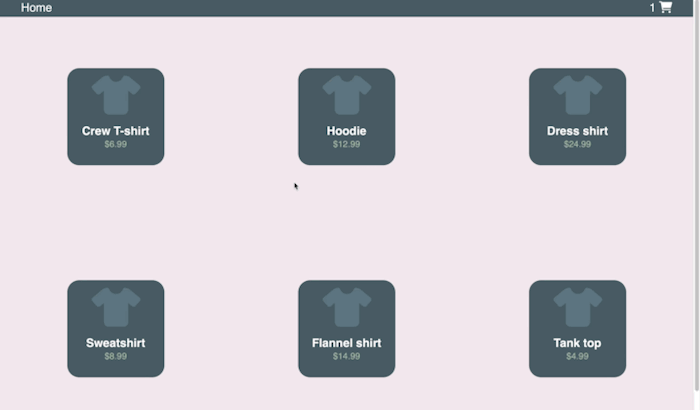

<h1 align="center">Shopping Cart</h1>

Client-side eCommerce web application built with React

## Demo

## About

Simple eCommerce SPA that uses JSON data retrieved from a REST API in order to display grocery products. The application features the ability to:

- add items to cart
- remove items from cart
- filter items by price
- calculate a subtotal cost

This application uses the following technologies:

- React
- SASS
- React Router
- Fetch API
- Heroku (for [json-server](https://www.npmjs.com/package/json-server) deployment)
- Netlify (for application deployment)